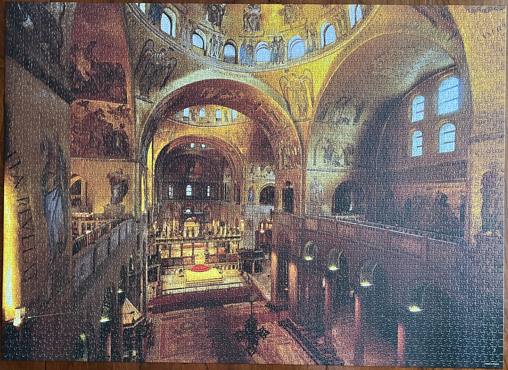
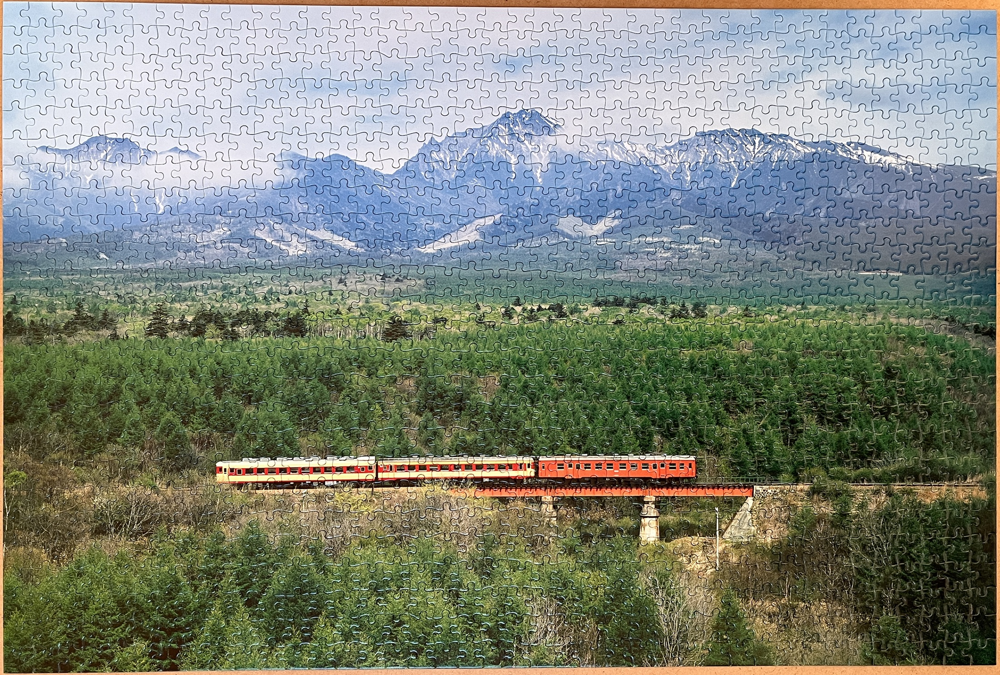
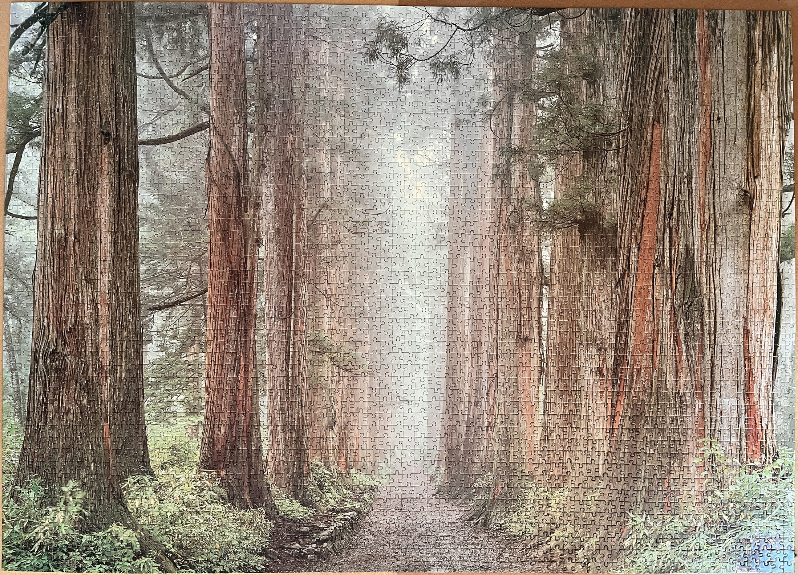
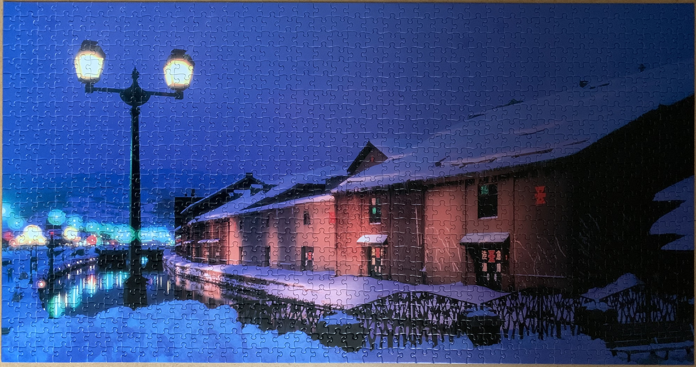
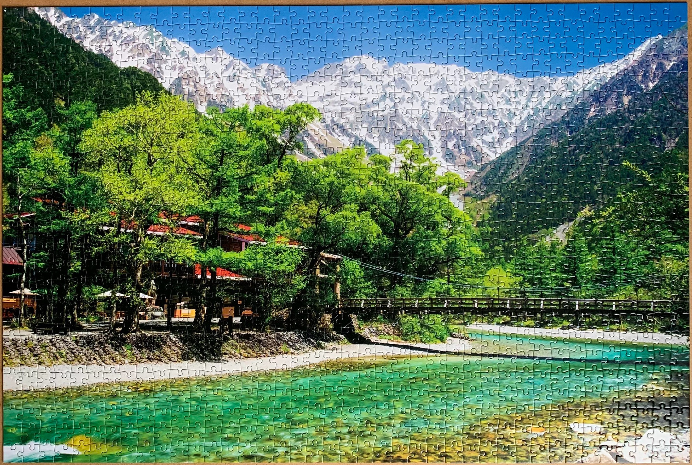
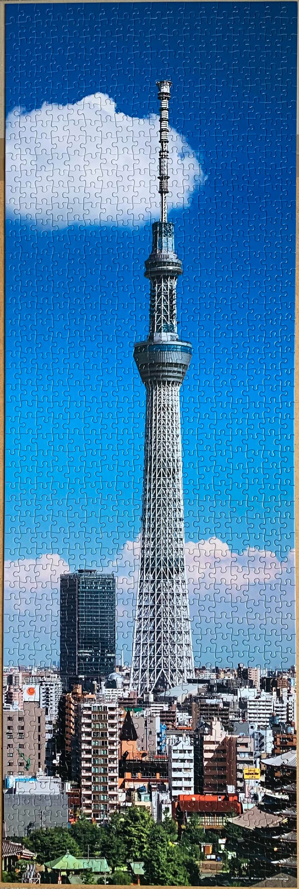

<a href="https://luffm.github.io/Jigsaw-Puzzles/">Jigsaw Puzzles</a>

## Saint Mark's Basilica (Italy)
2025-08-10 

 3000 pieces

## Train Journey - Distant Yatsugatake Mountains (Nagano)
2025-01-11 

 1000 pieces

## Narrow Path in the Depths
2024-09-12 

 3008 pieces

## View of Japan - Otaru Canal
2023-12-23 

 1000 pieces, Widevision, Glow-in-the-dark

## Flowing stream - Kamikochi Kappabashi bridge
2021-11-11 

 1000 pieces

## Tokyo Skytree
2021-09-25 

 954 pieces

<a href="https://luffm.github.io/Jigsaw-Puzzles/">Jigsaw Puzzles</a>

